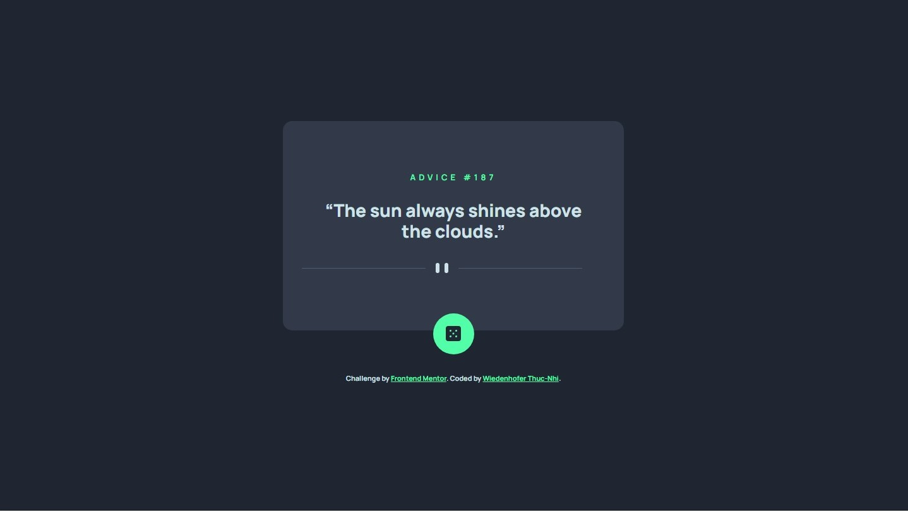

# Frontend Mentor - Advice generator app solution

This is a solution to the [Advice generator app challenge on Frontend Mentor]

## Table of contents

- [Overview](#overview)
  - [The challenge](#the-challenge)
  - [Screenshot](#screenshot)
  - [Links](#links)
- [My process](#my-process)
  - [Built with](#built-with)
- [Author](#author)

## Overview

### The challenge

Users should be able to:

- View the optimal layout for the app depending on their device's screen size
- See hover states for all interactive elements on the page
- Generate a new piece of advice by clicking the dice icon

### Screenshot

### Links

- Solution URL: [Github](https://github.com/thucnhi-wiedenhofer/advice_generator_app.github.io)
- Live Site URL: [live site URL](https://thucnhi-wiedenhofer.github.io/advice_generator_app.github.io/)

## My process

### Built with

- Semantic HTML5 markup
- CSS custom properties
- Flexbox
- Javascript

## Author

- Website - [portfolio](https://thuc-nhi-wiedenhofer.students-laplateforme.io/)
- Frontend Mentor - [@thucnhi-wiedenhofer](https://www.frontendmentor.io/profile/thucnhi-wiedenhofer)
